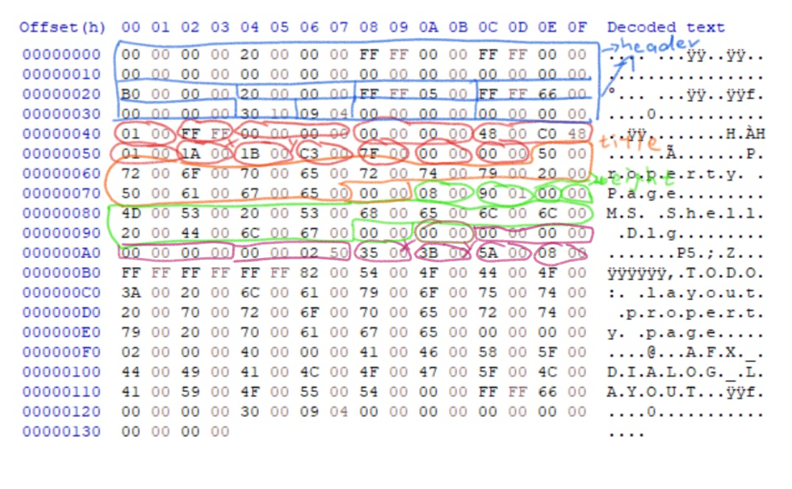

# Windows Dialog Resource Compiler Prototype

This is a simple demo prototype for indirect dialog creation method.

The dump file is originated from the default dialog box resource by Visual Studio 2019. The blue region contains 2 resource headers (1 for whole file, 1 for the following dialog resource), each has 32 bytes. Red, Orange (title string), Green (typeface string) region combined is the dialog template data. Brown region is 2-byte padding, following Purple region shows few fields at the beginning of a dialog control item, more fields come afterwards.
